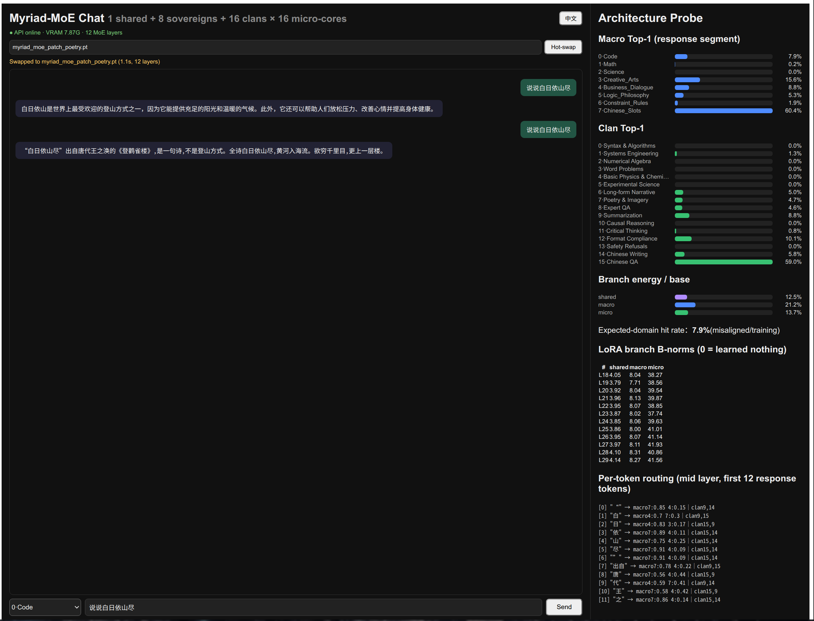

# Myriad-MoE: Hierarchical Fine-Grained MoE on Gemma-4-12B

[](https://huggingface.co/)
[](LICENSE)
[](https://www.python.org/downloads/)
[](https://pnpm.io/)

A hierarchical Mixture-of-Experts grafted onto a frozen **Gemma-4-12B** backbone (48 layers, hidden 3840): **1 shared sovereign + 8 macro cores + 16 clans × 16 micro-experts**, trained with supervised domain routing, 4-bit QLoRA-style adapters, and an instant hot-swappable patch workflow. 

Includes full data preparation, training recipes, a FastAPI inference engine with SSE streaming, and a Vite + React chat console with real-time routing probes.

> **Note**: Model weights (`*.pt`) and quantized base models live on 🤗 Hugging Face and must be acquired separately.

---

## Live Neuro-Surgery Demo


*Figure 1: Epistemic hotfix in action. In under 1.1s, loading `myriad_moe_patch_poetry.pt` hot-swaps active memory—instantly turning a catastrophic hallucination ("白日依山 is a mountaineering technique") into accurate poetic retrieval and self-correction, telemetry visualized in real time.*

---

## Architecture

MoE adapters are grafted onto **layers 18–29** (12 layers, 405.1M trainable params). The base model stays frozen (4-bit NF4).

```text
token hidden state ──┬── Shared sovereign (Rank-32, always on)
                     ├── Macro router: Top-2 of 8 cores (Rank-16 each)
                     └── Clan router: Top-2 of 16 clans × per-clan Top-2 of 16 micro-experts (Rank-16)
                           joint weight = P(clan) · P(expert | clan)

output = base_mlp(x) + shared + macro + micro      # gamma = 1.0, LoRA alpha/r only
```

- **True Top-K sparsity**: Unselected experts contribute exactly `0.0` (hard scatter mask, re-normalized Top-2 weights).
- **Load balancing**: Switch-style $\text{density} \times p_{\text{mean}}$ auxiliary loss on all three routing levels (micro loss is computed per clan, then averaged).
- **Supervised routing**: `core_id → macro` (8-way) + `cluster_id → clan` (16-way) cross-entropy on **response tokens only** (prompt templates are identical across domains and would otherwise feed contradictory labels).

---

## Data Pipeline

| Version | Size | Design |
| :--- | :--- | :--- |
| **v2** | 24k (8×3000, 16×1500) | Per-domain sources, but clans split by `idx % 2` (= random labels), cores 5/6/7 arbitrary alpaca slices. |
| **v2.4** | 24k, same shape | Semantic score-rank + fixed-quota clustering; `no_robots` split by category; `alpaca` split by constraint/logic keyword scores. |
| **v3** *(current)* | 28k (8×3500, 16×1750) | Dedicated source per core; Chinese slots (Belle 0.5M CN); real refusal pairs for safety clan (`mlabonne/harmful_behaviors` + fixed refusal templates). |

**v3 core map**: `0 Code` · `1 Math` · `2 Science` · `3 Creative` · `4 Dialogue` · `5 Logic` · `6 Constraint` · `7 Chinese-Slots`.  
*All splits are quota-enforced (`assert` locked) so the balance loss sees strictly uniform classes.*

---

## Training (`2.train_myriad_v2_24g_safe.py`)

- **Hardware**: 4-bit NF4 frozen base + bf16 adapters + PagedAdamW8bit, `B=1` × `ACCUM=16`, gradient checkpointing — peak ~13 GB VRAM, comfortably fits consumer 24 GB GPUs (RTX 3090 / 4090 / 5090).
- **Loss**: $\mathcal{L}_{\text{LM}} + 0.005 \cdot \mathcal{L}_{\text{aux}} + 0.3 \cdot \mathcal{L}_{\text{sup}}$, linear warmup (100 steps) + cosine decay to `3e-5` (`LambdaLR` — *note: `SequentialLR` silently freezes learning rates upon state restoration, resolved with a unified scheduling closure*).
- **Evaluation**: 240-sample held-out split with periodic `[val]` snapshots (LM loss / supervised accuracy).
- **Desktop GPU Protection**: Sequences are chunked ($\le 256$ tokens, 1-token overlap) to prevent display-watchdog timeouts (`Xid 8` error) on consumer cards under heavy backward passes.
- **Deterministic & Fault-Tolerant**: Seeded batch indexing with stateful rollover and emergency checkpoint dumps on OS signals.

> **v3 Results (5205 steps, 3 epochs)**:  
> Val macro Top-1: **66.2%** (chance: 12.5%) │ Clan Top-1: **45.6%** (chance: 6.25%) │ Val LM loss: **1.35**.

---

## Inference, Probing & Serving

- `3.infer_probe.py`: Generation & routing diagnostics. Inspects per-layer LoRA B-norms ($0 = \text{dead branch}$), branch/base energy ratios, macro/clan activation histograms, per-token Top-2 paths, and domain hit-rates. Includes `--base-only` mode for ablation.
- `server.py`: High-performance FastAPI server providing:
  - `POST /api/chat`: SSE token streaming.
  - `POST /api/probe`: Response-segment activation diagnostics.
  - `POST /api/hotswap`: Atomic weight replacement in volatile memory without CUDA context invalidation.
  - `GET /api/health`: Node status & VRAM monitoring.
- `web/`: Modern Vite + React chat console with real-time routing radars (`pnpm install && pnpm build`).

---

## Micro-Patch Workflow (`4.micro_patch.py`)

Perform targeted epistemic surgery without catastrophic forgetting or full retraining:

1. **Curate defect samples**: Capture the failure mode in targeted Q&A pairs (e.g., `poetry_patch.jsonl`).
2. **Micro fine-tune**: Train against existing v3 weights (e.g., 73 samples, 15 epochs, lr `6e-5`, ~10 min).
3. **Hot-swap**: POST to the live server with sub-second switchover:
   ```bash
   curl -X POST http://localhost:8000/api/hotswap \
     -H 'Content-Type: application/json' \
     -d '{"weight":"myriad_moe_patch_poetry.pt"}'
   ```
   *Swaps in 0.6–1.1s across 12 layers with zero downtime.*

---

## Repo Layout

```text
├── 1.prepare_myriad_data.py       # v2.4 semantic data pipeline (offline cache)
├── 1.prepare_myriad_v3.py         # v3 pipeline: dedicated sources + Chinese + refusals
├── 2.train_myriad_v2_24g_safe.py  # Main training loop (DATA_TAG=v3)
├── 3.infer_probe.py               # Local inference & routing probe
├── 4.micro_patch.py               # Targeted micro-adapter fine-tuning
├── poetry_patch.jsonl             # Example patch dataset
├── server.py                      # FastAPI backend with hot-swap mutex
└── web/                           # Vite + React frontend dashboard
```

*Large model weights (`*.pt`) and base models are excluded from version control. Ensure `../gemma-4-12B-it-qat-q4_0-unquantized` is located adjacent to this directory.*

---

## Quickstart

```bash
# 1. Prepare data (v3)
python3 1.prepare_myriad_v3.py

# 2. Train on 24GB GPU (~6 h on RTX 5090 / 4090)
python3 -u 2.train_myriad_v2_24g_safe.py

# 3. Diagnostic probe
python3 3.infer_probe.py --prompt "白日依山尽" --domain 7 --probe-only

# 4. Launch backend & UI
python3 server.py &
cd web && pnpm install && pnpm build && pnpm dev

# 5. Targeted patch hot-swap
python3 4.micro_patch.py --data poetry_patch.jsonl --out myriad_moe_patch_poetry.pt
curl -X POST http://localhost:8000/api/hotswap \
  -H 'Content-Type: application/json' \
  -d '{"weight":"myriad_moe_patch_poetry.pt"}'
```

---

## Public Prior Art & Disclosures

*Prepared to support prior-art searches and establish defensive publication. This is a technical record, not legal advice.*

### A. Public prior art this work builds on
- **LoRA** (*Hu et al., 2021, arXiv:2106.09685*): Low-rank adapters on frozen weights; this repository uses the same $\alpha / r$ scaling convention.
- **Switch Transformer** (*Fedus et al., 2021, arXiv:2101.03961*): Top-K sparse gating with $\text{density} \times p_{\text{mean}}$ auxiliary load balancing.
- **LLM.int8()** (*Dettmers et al., 2022, arXiv:2208.07339*): 8-bit mixed-precision matrix decomposition.
- **QLoRA** (*Dettmers et al., 2023, arXiv:2305.14314*): 4-bit NF4 base + higher-precision adapters.
- **DeepSeekMoE & DeepSeek-V3** (*Dai et al., 2024; Liu et al., 2024*): Fine-grained expert segmentation coupled with isolated shared experts.
- **Gemma family** (*Google*): 12B base architecture and sentencepiece tokenizer.

### B. Novel techniques disclosed by this repository
To the best of our knowledge, the following combination—as recorded in this repository's public commit history—was not previously published as an integrated system:

1. **Three-Level Hierarchical Conditional Routing**: `Top-2 of 8 macro` $\times$ `Top-2 of 16 clans` $\times$ `per-clan Top-2 of 16 micro-experts`, where joint probabilities $P(\text{clan}) \cdot P(\text{expert} \mid \text{clan})$ are evaluated in low-rank projection space.
2. **Response-Token-Only Supervised Gating**: Conditioning cross-entropy routing supervision exclusively on output/response tokens to avoid destructive gradient interference from domain-shared instruction scaffolds.
3. **Per-Clan Segmented Auxiliary Loss**: Calculating Switch-style load balance losses independently within each clan manifold and aggregating afterwards, preventing inter-clan probability suppression.
4. **Sequence-Chunked Training Under Desktop Xid 8 Constraints**: Exact forward/backward equivalence achieved via $\le 256$-token sliding blocks to completely evade consumer OS display watchdog kills.
5. **Single-Closure Unified Scheduling for Resumable MoE**: Bypassing PyTorch `SequentialLR` state corruption on checkpoint restoration via closed-form multi-phase `LambdaLR` step mapping.
6. **Live In-Memory MoE Weight Hot-Swapping**: Swapping layer-wise adapter slices (`POST /api/hotswap`) in volatile VRAM under concurrency locks, governed by dynamic routing probe telemetry without reloading the primary LLM context.
