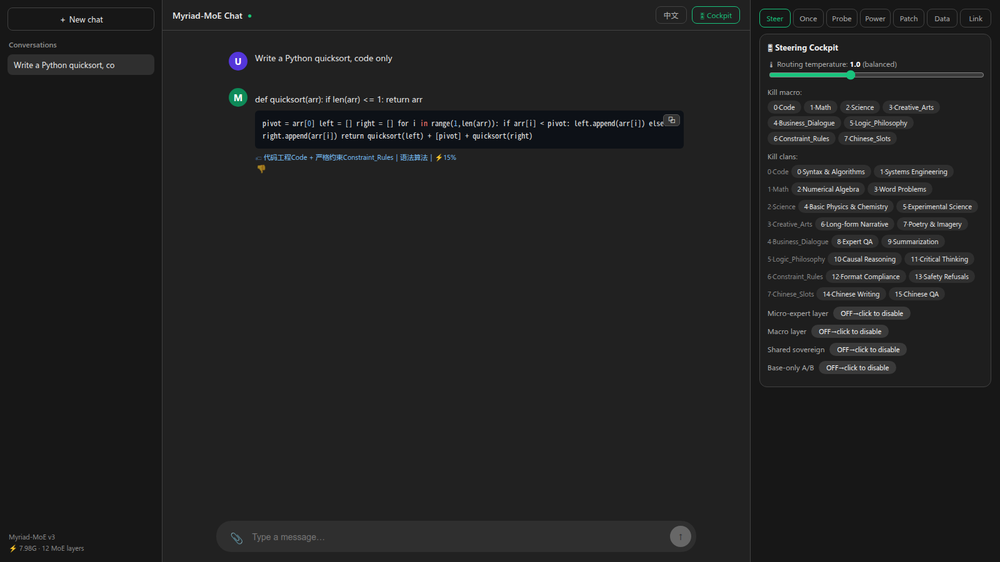
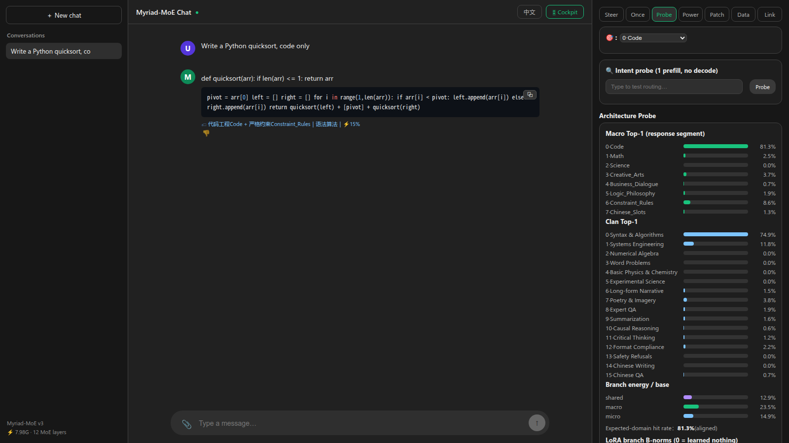
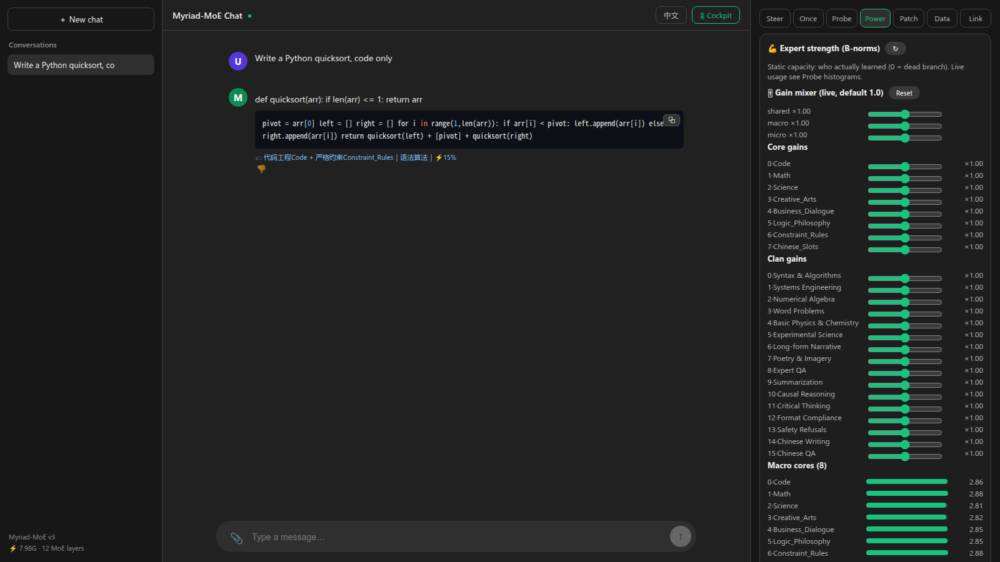
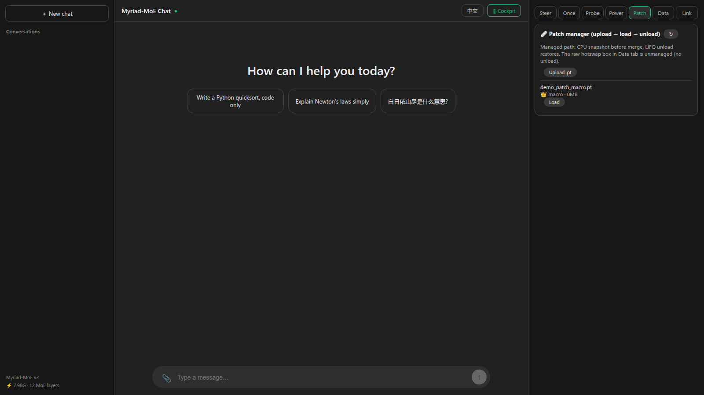
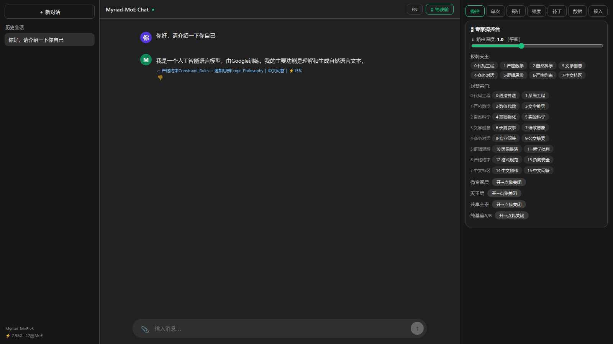

# Myriad-MoE: Hierarchical Fine-Grained MoE on Gemma-4-12B

Inspired by the **big.LITTLE architecture** in phone SoCs — a few big cores
for heavy lifting, many LITTLE cores for efficient background work, and a
scheduler that migrates tasks by demand — Myriad-MoE applies the same idea
to LLM adapters. Grafted onto a frozen **Gemma-4-12B** backbone (48 layers,
hidden 3840): **8 big macro cores** (Rank-16, Top-2 routed) take domain-level
work, **16 clans × 16 LITTLE micro-experts** absorb fine-grained load, and
**1 always-on shared core** holds global context like a system housekeeping
core. Learned routers play scheduler; training uses supervised domain
routing, 4-bit QLoRA-style adapters, and a hot-swappable patch workflow.
Ships with a FastAPI backend and a pnpm (Vite + React) chat UI with a live
routing probe.







## Architecture

MoE adapters are grafted onto layers **18–29** (12 layers, **405.1M**
trainable params). The base model stays frozen (4-bit NF4).

```
token hidden state ──┬── Shared sovereign (Rank-32, always on)
                     ├── Macro router: Top-2 of 8 cores (Rank-16 each)
                     └── Clan router: Top-2 of 16 clans × per-clan Top-2 of 16 micro-experts (Rank-16)
                           joint weight = P(clan) · P(expert | clan)
output = base_mlp(x) + shared + macro + micro      # gamma = 1.0, LoRA alpha/r only
```

- **True Top-K sparsity**: unselected experts contribute exactly `0.0`
  (hard scatter mask, re-normalized Top-2 weights).
- **Load balancing**: Switch-style `density × p_mean` aux loss on all three
  routing levels (micro loss is computed per-clan, then averaged).
- **Supervised routing**: `core_id → macro (8-way)` + `cluster_id → clan
  (16-way)` cross-entropy on **response tokens only** (prompt templates are
  identical across domains and would otherwise feed contradictory labels).

## Data pipeline

| Version | Size | Design |
|---|---|---|
| v2 | 24k (8×3000, 16×1500) | Per-domain sources, but clans split by `idx % 2` (= random labels), cores 5/6/7 arbitrary alpaca slices |
| v2.4 | 24k, same shape | Semantic score-rank + fixed-quota clustering; no_robots split by `category`; alpaca split by constraint/logic keyword scores |
| **v3 (current)** | **28k (8×3500, 16×1750)** | Dedicated source per core; Chinese slots (Belle 0.5M CN); real refusal pairs for the safety clan (`mlabonne/harmful_behaviors` + fixed refusal templates) |

v3 core map: `0 Code · 1 Math · 2 Science · 3 Creative · 4 Dialogue ·
5 Logic · 6 Constraint · 7 Chinese-Slots`. All splits are quota-enforced
(`assert` locked) so the balance loss sees uniform classes.

## Training (`2.train_myriad_v2_24g_safe.py`)

- 4-bit NF4 frozen base + bf16 adapters + `PagedAdamW8bit`, `B=1 × ACCUM=16`,
  gradient checkpointing — peak **~13 GB**, fits 24 GB cards.
- Loss: `LM + 0.005·aux + 0.3·sup`, linear warmup (100 steps) + cosine decay
  to 3e-5 (`LambdaLR` — note: `SequentialLR` silently freezes on
  `load_state_dict` resume, hence the single-function scheduler).
- 240-sample held-out split with periodic `[val]` snapshots (LM / sup-acc).
- Long sequences are chunked (≤256 tokens, 1-token overlap) — a display
  watchdog (`Xid 8`) on desktop GPUs kills unsplit 448-token backward bursts.
- Deterministic seed + absolute batch offsets: crash-safe resume, multi-epoch
  rollover, emergency checkpoint on exception.

v3 result (5205 steps, 3 epochs): **val macro Top-1 66.2 %** (chance 12.5 %),
**clan Top-1 45.6 %** (chance 6.25 %), val LM 1.35.

## Inference, probe, serving

- `3.infer_probe.py` — generate + routing probe: per-layer LoRA B-norms
  (0 = dead branch), branch/base energy ratios, macro/clan histograms,
  per-token Top-2 decisions, domain hit-rate. `--base-only` compares against
  the frozen base to attribute quality issues.
- `server.py` — FastAPI: `POST /api/chat` (SSE stream, multi-turn `history`,
  per-request steering overrides, `files` attachments),
  `POST /api/probe` (response-segment diagnostics), `POST /api/hotswap`
  (load new weights into the live server, no restart), `POST /api/upload`
  (image/audio attachments, video pending), `GET /data/badcases`,
  `GET /api/health`.
- `web/` — pnpm + Vite + React chat UI with an architecture panel
  (`pnpm install && pnpm build`; dev via `pnpm dev` with `/api` proxy).

## Experiment cockpit (steering + OpenAI gateway + data flywheel)

- `GET /api/domains` — semantic aliases, single-sourced from `domains.yaml`.
- `GET/POST /admin/steering` — global routing temperature (0.05–2.5),
  macro/clan kill-lists, branch kill-switches
  (`disable_shared/macro/micro/all`), context cap. Applies to all 12 layers.
- Per-request overrides on `/api/chat` (`routing_temperature`,
  `disabled_*`, `disable_*`, `force_macro`) plus text prefixes:
  `/force-code`, `/no-micro`, `/no-macro`, `/base-only`, `/cold`, `/wild`.
- `POST /v1/chat/completions` (+ `/v1/models`) — OpenAI-compatible,
  stream and non-stream, works with Cherry Studio / Continue.
  Extra `myriad_meta` (routing Top-2 + energies) rides along, terminal
  prints one ECG line per generation.
- `POST /v1/analyze/intent` — one prefill forward (no decode), returns
  macro/clan attribution for a prompt. Costs one forward, not zero.
- `POST /admin/reload-weights` (alias of `/api/hotswap`),
  `POST /admin/gpu-clear`, `POST /data/mark-badcase` → `hard_cases_v4.jsonl`.
- Web UI: right column = steering cockpit (temperature slider, macro
  kill-switches, branch toggles) + architecture probe; every AI message
  carries a routing badge and a 👎 button wired to the bad-case file.
- Chat is multi-turn (`history` field, server-side Gemma templating, left
  truncation at the context cap), abort-safe (client disconnect trips a
  per-request `StoppingCriteria` so the GPU lock is always released), and
  renders Markdown with highlighted code blocks (copy button included),
  KaTeX math, and multi-session sidebar with localStorage history.
- Multimodal attachments: the vision/audio towers stay resident (4-bit, ~idle
  7.9 GB total); `POST /api/upload` + `files` field on chat builds official
  template inputs (image 280 soft-tokens, audio features), with post-hoc
  routing telemetry on the same inputs. Video deferred (32-frame sampling).
- Cockpit tabs: Steer (global) / Once (one-shot per-request overrides:
  temperature, pin macro, kill lists, branch switches, max tokens,
  prefix shortcuts — auto-cleared after send) / Probe (intent tester +
  full diagnostics) / Power (`GET /api/strength`: per-core/per-clan B-norms
  averaged over 12 layers + per-layer branches; static capacity view; the
  same tab hosts a live gain mixer — branch/core/clan multipliers 0–2,
  `gain_*` in global steering and per-request overrides, defaults 1.0) /
  Data (VRAM, context cap, hot-swap, bad-case list)
  / Link (OpenAI-compatible connection info for Cherry Studio etc.).

## Micro-patch workflow (`4.micro_patch.py`, `poetry_patch.jsonl`)

Targeted hotfix without full retraining, demonstrated on a real failure
(model called 白日依山尽 "a mountaineering technique"):

1. Write ~tens of Q&A pairs covering the failure mode.
2. Micro-fine-tune on v3 weights (73 samples, 15 epochs, lr 6e-5, ~10 min).
3. Verify offline (`--weight patch`), then `POST /api/hotswap` — 0.6 s,
   zero downtime, quicksort regression-checked.

Split patches (small files, stackable): `4a.macro_patch.py` trains only the
macro branch (~24 MB) for routing-feel fixes; `4b.micro_patch.py` trains only
the target clans' micro slices (~50 MB/clan, `--clusters 4,5`, auto-detected
from data) with other slices grad-masked frozen. `POST /api/hotswap` merges
either scope by slice (old full files still overwrite); shared stays frozen
in both. `4.micro_patch.py` remains as the full-fallback.

Managed patches live in the web **Patch** tab: `POST /api/patches/upload`
(.pt, ≤2G, scope auto-detected into a sidecar), `GET /api/patches` (list +
loaded stack), `POST /api/patches/apply` (CPU snapshot of covered regions,
then slice-merge — a failed apply auto-rolls back), `POST
/api/patches/unload` (LIFO pop restoring the snapshot). Stacks compose:
base v3 → macro → clan(s). Raw `/api/hotswap` stays unmanaged (no unload).

## Repo layout

```
1.prepare_myriad_data.py   # v2.4 semantic data pipeline (offline cache)
1.prepare_myriad_v3.py     # v3 pipeline: dedicated sources + Chinese + refusals
2.train_myriad_v2_24g_safe.py  # training (DATA_TAG=v3)
3.infer_probe.py           # inference + routing probe
4.micro_patch.py           # targeted micro-fine-tune (full fallback)
4.patch_lib.py             # shared patch plumbing (data/system/loop, not run directly)
4a.macro_patch.py          # macro-only patch (~24MB)
4b.micro_patch.py          # clan-slice micro patch (~50MB/clan)
poetry_patch.jsonl         # example patch data
domains.yaml               # single source of truth for core/clan names
server.py                  # FastAPI backend
web/                       # pnpm chat UI (Vite + React, `pnpm install && pnpm build`)
images/                    # UI screenshots for this README
requirements.txt           # backend deps (`uv pip install -r requirements.txt`)
AGENTS.md                  # repo conventions for coding agents
```

Large artifacts (`*.pt` weights/checkpoints, the base model dir) are not
committed — use Git LFS or external storage. You need
`../gemma-4-12B-it-qat-q4_0-unquantized` (Gemma-4-12B tokenizer + weights)
next to this repo.

## Quickstart

```bash
# 0. deps (torch CUDA build must pre-exist; torchvision must match it)
uv pip install -r requirements.txt
# 1. data (v3)
python3 1.prepare_myriad_v3.py
# 2. train (~6 h on RTX 5090-class, resumes from checkpoint_v3.pt)
python3 -u 2.train_myriad_v2_24g_safe.py
# 3. probe
python3 3.infer_probe.py --prompt "..." --domain 0 --probe-only
# 4. serve + UI
python3 server.py &                 # :8000
cd web && pnpm install && pnpm build
# 5. targeted fix, then hot-swap (no restart)
python3 4.micro_patch.py --data poetry_patch.jsonl --out myriad_moe_patch_poetry.pt
curl -X POST localhost:8000/api/hotswap -H 'Content-Type: application/json' \
  -d '{"weight":"myriad_moe_patch_poetry.pt"}'
```

## Public Prior Art & Disclosures

Prepared to support prior-art searches. This is a technical record, not
legal advice.

### A. Public prior art this work builds on

- **LoRA** (Hu et al., 2021, arXiv:2106.09685) — low-rank adapters on frozen
  weights; this repo uses the same `alpha/r` scaling convention.
- **Switch Transformer** (Fedus et al., 2021, arXiv:2101.03961) — Top-K
  sparse gating with the `density × p_mean` load-balance auxiliary loss,
  reused here on all three routing levels.
- **LLM.int8()** (Dettmers et al., 2022, arXiv:2208.07339) — 8-bit
  mixed-precision decomposition for serving/training large models.
- **QLoRA** (Dettmers et al., 2023, arXiv:2305.14314) — 4-bit NF4 frozen
  base + bf16 adapters; this repo's training setup.
- **DeepSeekMoE** (Dai et al., 2024) and **DeepSeek-V3** (Liu et al., 2024)
  — fine-grained expert segmentation with shared experts; the conceptual
  basis for the shared-sovereign + fine-grained-micro-expert hierarchy here.
- **Gemma family** (Google) — the frozen 12B backbone and tokenizer.
- Standard tooling: gradient checkpointing, AdamW (incl. 8-bit paged
  variants via bitsandbytes), cosine schedules with warmup, FastAPI + SSE
  streaming, Vite + React frontends.

### B. What this repository publicly discloses

To the best of our knowledge the following combination, as implemented in
this repo's commit history, was not previously published as a whole:

1. Three-level conditional routing (`Top-2 of 8` macro × `Top-2 of 16`
   clans × per-clan `Top-2 of 16` micro-experts) with the joint weight
   `P(clan) · P(expert | clan)` computed in low-rank space.
2. Response-token-only supervised routing (`core_id`/`cluster_id` CE) to
   avoid contradictory labels from domain-shared prompt templates.
3. Per-clan Switch-style micro auxiliary loss (averaged, same scale as the
   macro/clan terms) instead of a flat mean-squared uniformity term.
4. Sequence-chunked fine-tuning (≤256 tokens, 1-token overlap, exact LM/sup
   equivalence) as a mitigation for display-watchdog (`Xid 8`) kills on
   desktop GPUs.
5. Single-function warmup+cosine scheduler (`LambdaLR`) chosen after
   observing frozen learning rates when resuming multi-scheduler
   (`SequentialLR`) state.
6. Live weight hot-swap (`POST /api/hotswap` under a model mutex) fed by
   targeted micro-fine-tunes, with a routing probe (macro/clan histograms,
   branch energies, per-token Top-2) as the acceptance check.

Corrections to dates, attributions, or IDs above are welcome via issues/PRs.

